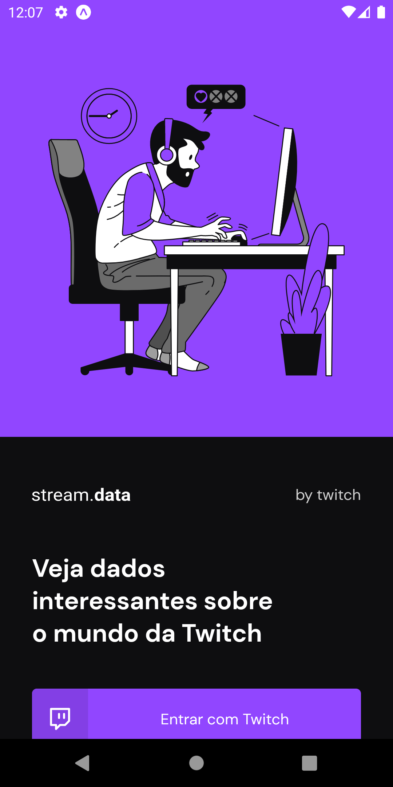

<p align="center"></p>

> Project developed during the challenge of Chapter II - React Native Trail with social login with Twitch. The entire login and logout flow was implemented using Twitch's OAuth

# 🔄 Application Screens
<div>
  
  
</div>

# 🎨 Functionalities
- Social login with Twitch.
- Refresh the screen without reloading the application.
- Lists all the live channels you follow.
- Lists the most watched channels on Twitch.
- Logout to clear application login information.

# 🏇 Technologies
- [React Native](https://reactnative.dev/)
- [Expo](https://expo.dev/)
- [Axios ](https://axios-http.com/)
- [Moti](https://moti.fyi/)
- [Google Fonts](https://fonts.google.com/)
- [Styled-components](https://styled-components.com/)
- [TypeScript](https://www.typescriptlang.org/)
- [Babel](https://babeljs.io/)

## 💻 Cloning the project to your machine
1. Open your computer's terminal.
2. Access your projects folder.
3. Once inside your projects folder, execute the commands below:
```bash
# To download the project to your computer
$ git clone https://github.com/gabrielmerigo/stream-data.git

# Enter project folder
$ cd stream-data

# To download project dependencies
$ yarn

# Open with vscode editor
$ code .
```
4. Ready, now just test and make the changes you want.

## 🔥 How to run the project on your mobile using expo
1. Copy and rename the `.env.example to` file to `.env`.
2. Go to Twitch and log into your account, or if you have one, log in.
3. Go to the link [https://dev.twitch.tv/console/apps/create](https://dev.twitch.tv/console/apps/create) to register a new application.
- **Name**: Give your application a name.
- **OAuth redirect URLs**: https://auth.expo.io/@your-user/yourAppName
- - **Grades**:
- - @your-user: To get your username access your profile [https://www.twitch.tv/settings/profile](https://www.twitch.tv/settings/profile).
- - To get the name of your application, access the `app.json` file in the `"slug": "streamData",` statement. If you don't have this line, insert it.
- **Category**: Select `Application Integration`
- Check that you are not a Droid.
- Click on the Create button.
- After this step you will see your **client ID**, just copy it to the `.env` file you copied and renamed before.

4. Now inside the application folder by the terminal, execute the command below:
```bash
# This command makes the project available to be opened by the expo application that
# you need to install on your physical device or emulator.
$ expo start
```
5. Then, with the **Expo Go** application installed on your smartphone, simply read the QRCode that appears on your computer screen.

> **Note**: Your mobile and computer must be on the same wifi network and in the same IP range for the app to work between your computer and your mobile.

## ✔️ Questions
If you had any questions, you can contact me here. [gabriel.merigo.dev](https://www.linkedin.com/in/gabrielmerigo/).

## 📄 Licença MIT
- Consult the [LICENÇA](LICENSE) for more information.
<br/><br>
<p align="center"> Made with 💜 by <a href="https://github.com/gabrielmerigo"> Gabriel Merigo </a></p>
